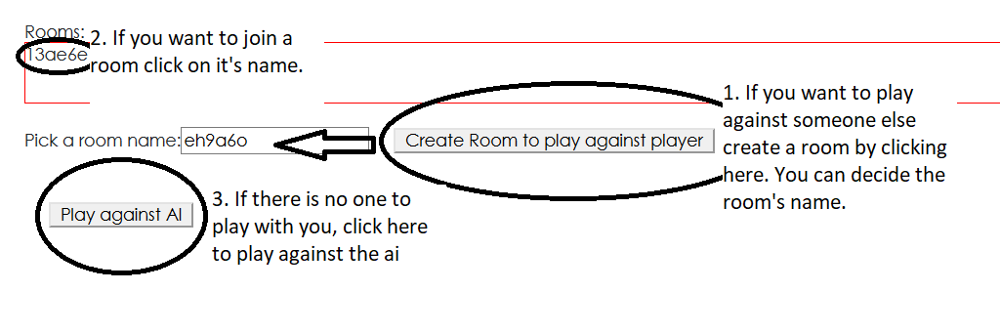

# Quoridor: On Online Instance
The rules of the game are pretty straight forward. It is a turn based game played on a 9x9 board and the goal is to reach the opponent's starting row. (check the figure below for more details)

You can also built walls in order to prevent your oppenent from reaching their goal. To do so click on one of the tiles.

       

# Client

So the client was built in react in order to not have to move from one url to another.
React automatically updates the page but only the components that changed.
I also used Socket.io so we could say this app is event driven. The basis behind it is the following:

On the main page of the client you have three options:

# Here is the link to play the game: https://efbmachine.github.io/quoridor_client.js.

# Server

The server was built using socket.io and express. It allows a smooth communication between the users.
Let me explain how it work in a brief and simplified case.
    
   1 - user1 --(ask to create room)-->  server (creates room and place user in room)
    
   2 - user2 --(ask to join room 'xxxxx')--> server (adds user2 in room 'xxxxx' if not already 2 people)
    
   3 - user1  --(makes move) -->  server(check if move valid) --(send move)--> user2
    
   4 - user1  --(makes move) -->  server(check if move valid) --(send move)--> user2
    
and steps 3 & 4 keep repeating themselves until one of the users actually wins.                          

Hope you enjoy the game even if the inteface is not great.
    -Keiffer
