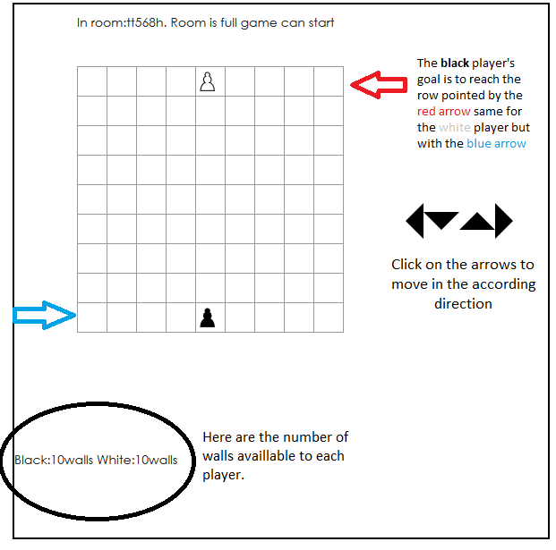
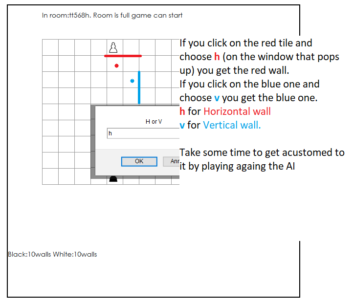

# Quoridor: On Online Instance
The rules of the game are pretty straight forward. It is a turn based game played on a 9x9 board and the goal is to reach the opponent's starting row. (check the figure below for more details)

You can also built walls in order to prevent your oppenent from reaching their goal. To do so click on one of the tiles.

       

Here is the link to play the game: https://efbmachine.github.io/quoridor_client.js         

I hope you enjoy it.   
            -Keiffer
